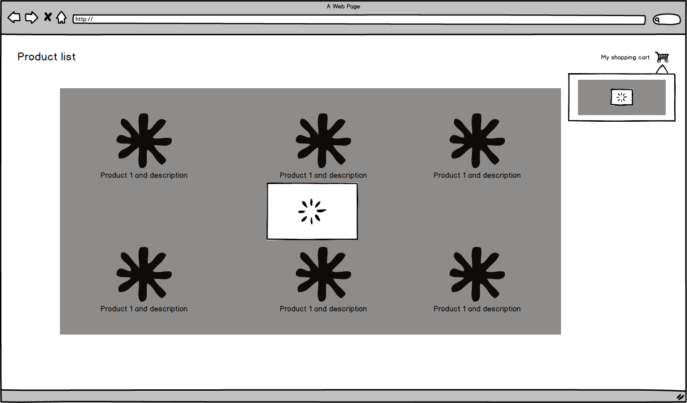

# react-promise-tracker

Componente React Hoc, rastreador de promesas.
 Puedes verlo en acción: [Demo](https://stackblitz.com/edit/react-promise-tracker-default-area-sample)

## ¿Por qué necesito esto?

Algunas veces necesitas rastrear promesas bloqueantes (ejemplo: fetch http calls),
para escoger entre mostrar un spinner de cargando... o no.

Esta librería implementa:

- Una función simple que te permitirá rastrear una promesa.
- Un componente HOC, que  nos permitirá  usar un wrapper como spinner de cargando... (se mostrará cuando el número de peticiones rastreadas sea mayor que cero, y estará oculto cuando no).

## Instalación

```cmd
npm install react-promise-tracker --save
```

## Uso

Siempre que quieras rastrear una promesa, simplemente usa el componente como wrapper tal como se muestra en el siguiente código:

```diff
+ import { trackPromise} from 'react-promise-tracker';
//...

+ trackPromise(
    fetchUsers(); // You function that returns a promise
+ );
```

Entonces solo necesitas crear el componente que define una propiedad llamada _trackedPromiseInProgress_

Y envolverlo con el _promiseTrackerHoc_

## Ejemplo básico

```diff
import React, { Component } from 'react';
import PropTypes from 'prop-types';
+ import { promiseTrackerHoc} from 'react-promise-tracker';

const InnerLoadingSpinerComponent = (props) => {
  return (
    <div>
    {
      (props.trackedPromiseInProgress === true) ?
        <h3>Hey I'm a spinner loader wannabe !!!</h3>
      :
        null
    }
  </div>
  )
};

InnerLoadingSpinerComponent.propTypes = {
  trackedPromiseInProgress : PropTypes.bool.isRequired,
};

+ export const LoadingSpinnerComponent = promiseTrackerHoc(InnerLoadingSpinerComponent);
```

- Para añadir un component spinner atractivo,  puedes hacer uso de _react-spinners_:

  - [Demo page](http://www.davidhu.io/react-spinners/)
  - [Github page](https://github.com/davidhu2000/react-spinners)

- Luego en el punto de entrada de tu apliación (main / app / ...) solo añade este componente loading spinner, para que sea renderizado:

```diff
import React from 'react';
+ import { LoadingSpinnerComponent} from './loadingSpinner';

export const AppComponent = (props) => (
  <div>
    <h1>Hello App!</h1>
+   <LoadingSpinnerComponent />
  </div>
);
```

## Ejemplo con áreas

Es posible usar react-promise-tracker como si se mostrara un solo spinner en la página. Hay casos en los que desea mostrar un spinner solo bloqueando cierta área de la pantalla (por ejemplo, una aplicación de lista de productos con una sección de carrito de la compra).
Nos gustaría bloquear esa área de la UI (mostrar sólo el spinner) mientras carga el producto, pero no el resto de la interfaz de usuario, y lo mismo con la sección pop-up del carro de compras.



Podemos añadir el área `default-area` para mostrar el spinner de la lista de productos:

```diff
import React from 'react';
+ import { LoadingSpinnerComponent} from './loadingSpinner';

export const ProductListComponent = (props) => (
  <div>
    ...
+   <LoadingSpinnerComponent /> // default-area
  </div>
);
```

Si añadimos el área, `shopping-cart-area` mostraremos el spinner del carro de compra:

```diff
import React from 'react';
+ import { LoadingSpinnerComponent} from './loadingSpinner';

export const ShoppingCartModal = (props) => (
  <div>
+   <LoadingSpinnerComponent area="shopping-cart-area" />
  </div>
);
```

Con este enfoque, no necesitamos definir diferentes componentes spinners, con uno solo podemos renderizarlo cuando queramos rastrear promises en una determinada área:

```diff
+ import { trackPromise} from 'react-promise-tracker';
...
+ trackPromise(
    fetchSelectedProducts();
+ ,'shopping-cart-area');
```

## Demos

Si quieres verlo en acción puedes visitar:

- [Ejemplo del área por defecto](https://stackblitz.com/edit/react-promise-tracker-default-area-sample)

- [Ejemplo de dos áreas](https://stackblitz.com/edit/react-promise-tracker-two-areas-sample)

## Sobre Lemoncode

Somos un equipo de una larga experiencia como desarrolladores freelance, establecidos como grupo en 2010.
Estamos especializados en tecnologías Front End y .NET. [Click aquí](http://lemoncode.net/services/en/#en-home) para más info sobre nosotros.

Para la audiencia LATAM/Español estamos desarrollando un máster Front End Online, más info: [http://lemoncode.net/master-frontend](http://lemoncode.net/master-frontend)
